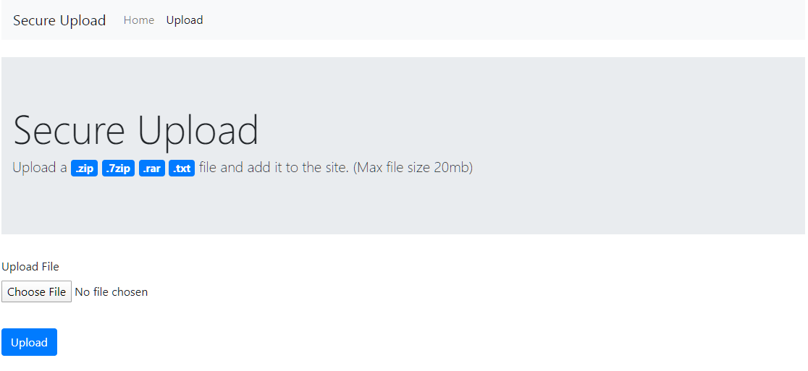

# secure-upload
A secure PHP file up-loader, restrict file types and size.



Very easy to customise.

```php
class config {
     static $allowedFiles = ["zip","7zip","rar", "txt"];
     static $uploadDir = "./user uploads/";
     static $maxFileSize = 20 * 1000000; // 20mb
}
  ```